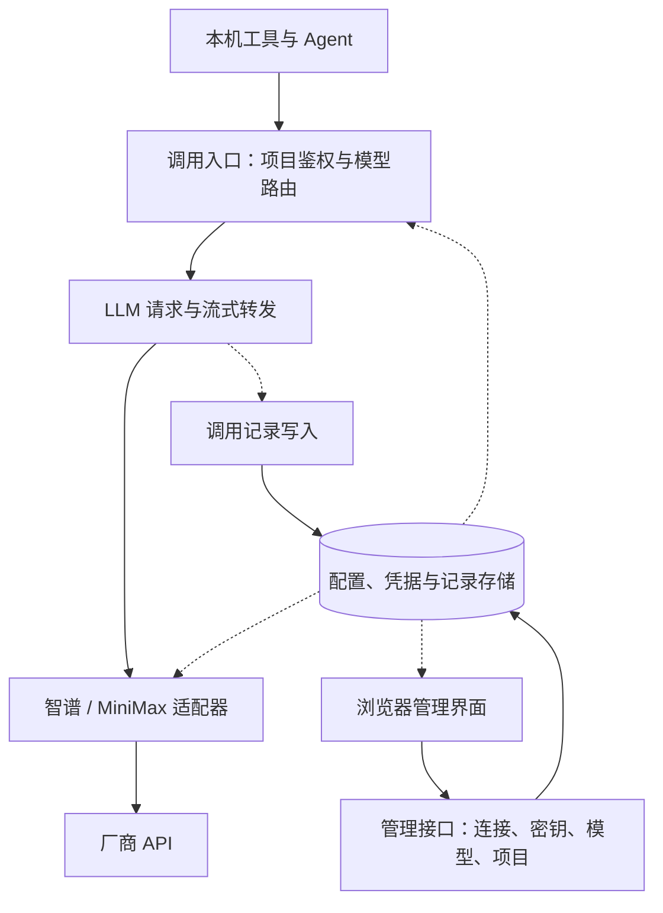

# 本地 AI 网关：第一版范围、架构与技术选型

更新日期：2026-09-15

状态：**第一版可运行 Demo 已实现**。采用用户确认的 **Go＋React／TypeScript＋Vite＋SQLite** 与 **A 的整体结构＋B 的请求详情页**。页面已支持连接／厂商 Token、模型、项目权限配置；具备加密存储、普通与流式转发、调用记录及本地模拟模型。真实厂商联调尚未执行。

启动与使用见 [Demo 使用说明](docs/demo.md)，运行 `bash scripts/start.sh` 后打开 [本地管理页面](http://127.0.0.1:8317/)。首次密码由用户自行设置，没有预置管理员密码。

当前代码的整体结构、核心对象、调用过程、权限与密钥、数据和 Linux 迁移逻辑，见 [当前架构与实现逻辑](docs/current-architecture.md)。

## 1. 已确认的两项决定

### 1.1 先在本地实现，为未来迁移 Linux 做准备

第一版在当前 Mac 上运行，供本机工具和 Agent 调用。核心服务、管理界面、配置、数据与密钥解锁机制应允许未来部署到单台 Linux 服务器，迁移时保留业务接口和核心逻辑。

迁移准备是第一版的设计约束；实际部署 Linux 是后续工作。它不等于现在需要分布式架构、多机部署或容器编排。

### 1.2 第一版只做大语言模型

第一版聚焦大语言模型的接入、普通与流式调用、密钥管理、项目访问控制，以及请求和响应记录。

首批建议接入已有 Key 的智谱和 MiniMax，具体模型 ID、套餐端点和协议能力在接入时核实。此前讨论的百炼 ASR、豆包 ASR、火山视频生成均为后续候选能力，不属于第一版实现范围，也不是第一版交付的前提。

## 2. 目标与范围

目标：让各个项目通过稳定的网关地址与模型别名使用大语言模型，真实厂商 Key 由网关保管，并能查看经过网关的模型通信。

| 第一版包含 | 具体结果 |
| --- | --- |
| 厂商连接与 Key 管理 | 在管理界面配置、修改和查看经授权解锁的凭据；项目侧只持有网关访问凭证 |
| 模型别名与默认参数 | 别名映射到连接、真实模型 ID、已支持的默认参数 |
| 普通与流式文本调用 | 支持普通返回和 SSE 事件流，及时返回上游内容 |
| Agent 所需的协议内容 | 在所支持的协议中保留消息角色、工具定义、工具调用、工具结果及厂商要求回传的内容块；工具仍由客户端执行 |
| 项目访问凭证 | 每个项目有独立身份，限制可用模型，支持撤销 |
| 调用记录与管理页面 | 查看输入、返回、模型、时间、上游用量与错误，支持按项目筛选 |
| Linux 迁移准备 | 配置化地址与数据路径、可移植核心、版本化数据、独立的密钥解锁接口 |

首批协议入口建议采用 Chat Completions 风格接口，以及 MiniMax 对应的 Anthropic Messages 风格接口。同协议优先转发，必要时修改模型别名与鉴权。不同协议之间的转换需要逐项确认语义，不默认实现任意协议互转。客户端只支持 Responses 等其他协议时，需要另行评估适配；支持自定义端点不等于完全兼容。

智谱提供 SSE 流式消息；MiniMax 的 Anthropic 兼容接口要求在相关多轮工具调用中保留完整返回内容块，网关不能只保留可见文本。参见 [智谱流式消息](https://docs.bigmodel.cn/cn/guide/capabilities/streaming) 与 [MiniMax Anthropic SDK 文档](https://platform.minimax.cn/docs/api-reference/text-anthropic-api)。

后续范围：ASR、TTS、视频生成、媒体上传和对象存储、后台生成任务；更广泛的账号密码管理和向项目分发真实密钥；自动选模型、自动跨厂商回退、对话编排。第一版不预先实现这些功能，也不为其建立空的任务系统或媒体数据库。

## 3. 第一版基本架构

部署形态：一个常驻服务进程、一个浏览器管理界面、一套本地数据。模块在同一程序内部划分。

正常流程：项目提交消息 → 校验项目身份 → 查找模型别名 → 选择厂商连接 → 内部取得 Key 并加入请求 → 接收并返回响应 → 保存调用记录。

管理界面与项目调用使用不同权限。项目凭证只能调用被允许的模型，不具有读取真实 Key、修改厂商地址或查看其他项目完整记录的权限。供应商地址由管理配置确定，不允许客户端借模型调用指定任意目的地址并携带厂商 Key。

| 核心对象 | 含义 |
| --- | --- |
| 厂商连接 | 适配器、端点、套餐／地域信息、加密凭据 |
| 模型配置 | 模型别名、连接 ID、真实模型 ID、默认参数、已验证能力 |
| 项目 | 调用方名称、访问凭证校验信息、允许使用的模型 |
| 调用记录 | 请求 ID、项目 ID、模型别名与真实模型、输入输出、时间、用量、记录完整性 |

初期只按客户端提供的内容调用模型，不自动从日志补充上下文。客户端提供会话 ID 时可以归组；没有会话 ID 时按请求展示，不猜测多个请求是否属于同一个 Agent 任务。

## 4. Linux 迁移必须保留的边界

| 现在的设计约束 | 用途 | 后续验证方式 |
| --- | --- | --- |
| 核心服务不依赖桌面窗口 | Linux 无桌面环境也能运行 | 在 Linux 启动服务，远程打开管理页面 |
| 地址、端口、数据目录、外部访问地址可配置 | 避免绑定本机路径和回环地址 | 更换配置后启动；项目仅修改网关地址 |
| 管理页面通过相对 API 路径访问服务 | 页面打开在 Mac、服务在 Linux 时仍可用 | 页面中无写死的本机 API 地址 |
| 数据格式与数据库变更有版本 | 配置和历史记录可迁移、可升级 | 从一致备份恢复并查询记录 |
| 主密钥解锁与业务逻辑分离 | 避免密钥只能依赖 macOS 钥匙串 | 验证加密导出／导入及 Linux 解锁方案 |
| 模型转发与日志不依赖平台命令 | 避免从 Mac 迁移后重写请求处理 | 对相同模拟上游执行协议测试 |
| 服务启动方式独立 | 本地手动启动与 Linux systemd 共用程序 | 验证停止、启动与配置加载 |

本地默认监听回环地址。远程 Linux 使用 HTTPS、项目鉴权及独立管理权限，反向代理须保留 SSE 流式行为。容器只是可选部署方式，不作为首版运行依赖。

密钥在数据中加密保存，解密所需的主密钥单独管理。本机可接系统钥匙串；Linux 可接受保护的服务凭据或启动解锁。迁移不能只复制依赖 Mac 钥匙串的数据库，应设计加密导出／导入流程。真实 Key 只在受信任的服务端使用，不通过模型调用接口返回。

迁移 SQLite 时使用停机的一致备份或数据库备份接口，不能在数据库活跃写入时仅复制主文件。参见 [SQLite Backup API](https://sqlite.org/backup.html)。

## 5. 后端技术选型依据：已选择 Go

以下是针对本项目的工程判断，不是性能实测排名。四种方案均可部署到 Linux，也都能实现流式 HTTP；当前最需要比较的是开发成本、运行依赖、维护方式和个人学习目标。

| 方案 | 优点 | 缺点与成本 | Linux 部署 | 适合的优先目标 |
| --- | --- | --- | --- | --- |
| **Go＋标准库 net/http** | HTTP、连接池、取消传播等能力集中；可以把前端静态文件嵌入程序；运行与交付结构清楚 | 前后端使用不同语言；厂商协议适配需要自己维护；仍有 GC；涉及 CGO、SQLite 驱动或钥匙串库时需验证构建依赖 | 为目标系统和架构构建可执行文件，配数据目录与服务配置 | 长期常驻、轻量运行、理解网络转发、方便搬迁 |
| **TypeScript＋Node.js＋Fastify** | 前后端同一种语言；共享类型方便；对熟悉 JS/TS 的开发者，迭代界面和 API 较直接；支持流响应 | 需要管理 Node 运行时和 npm 依赖；类型在运行时不自动验证；同步大 JSON 处理、文件操作会阻塞事件循环 | 安装约定的 Node 版本，部署构建产物和依赖；含原生模块时需为 Linux 重建 | 优先快速做出第一版、前后端统一语言 |
| **Python＋FastAPI＋HTTPX** | 对 Python 使用者容易理解；厂商示例和实验代码接入方便；数据校验、接口文档方便 | Python、虚拟环境和服务运行依赖需要管理；同步 SDK 混入异步路径可能阻塞；需管理长期存活的 HTTP 客户端 | Python 环境＋锁定依赖＋ASGI 服务；可使用容器固化环境 | 已熟悉 Python、希望频繁试模型和处理实验数据 |
| **Rust＋Axum＋Tokio** | 可以精细控制内存与资源；无需 GC；类型系统能提前发现部分生命周期和并发错误 | 所有权、异步类型与错误处理的学习成本较高；改动和编译反馈通常比轻量脚本流程复杂；厂商适配仍需维护 | 为 Linux 构建，处理目标架构及系统库／TLS依赖 | 明确希望学习 Rust，或已有严格的资源与尾延迟目标 |

技术依据：Go 的 [HTTP Transport](https://pkg.go.dev/net/http#Transport) 支持复用连接，客户端与 Transport 应复用；[embed](https://pkg.go.dev/embed) 可将静态文件放入程序。平台构建目标见 [Go 官方说明](https://go.dev/doc/install/source)。

Fastify 支持直接发送流，参见 [Reply / Streams](https://fastify.dev/docs/latest/Reference/Reply/#streams)。事件循环阻塞影响请求处理，参见 [Node.js 官方解释](https://nodejs.org/learn/asynchronous-work/dont-block-the-event-loop)。

FastAPI 提供 [StreamingResponse](https://fastapi.tiangolo.com/advanced/custom-response/#streamingresponse)，同步和异步第三方调用要按其 [异步使用说明](https://fastapi.tiangolo.com/async/) 组织。Axum 提供 [SSE 响应](https://docs.rs/axum/latest/axum/response/sse/)，底层运行方式参见 [Axum 文档](https://docs.rs/axum/latest/axum/)。

### 5.1 主推荐：Go

推荐依据是用户已经表达的目标：工具专注、常驻轻量、以后移到 Linux，同时希望通过网关理解模型通信。

1. **部署组成少。** 前端构建成静态资源并嵌入程序后，运行环境主要是网关可执行文件、配置与数据。前端构建需要的 Node 不必成为运行时服务。
2. **网关功能与语言能力匹配。** 第一版以 HTTP 转发、SSE、取消和连接复用为主，可以通过较直接的代码看到请求经过的步骤。
3. **平台相关部分容易隔离。** 把密钥解锁和服务启动独立出来，核心逻辑可以在 Mac 与 Linux 复用。具体依赖仍需跨平台验证。
4. **便于维持小的产品范围。** 标准库先完成必要路由与转发，根据真实需求再补充依赖。

代价：需要同时维护 Go 和前端 TypeScript；请求校验、模型参数映射及跨语言契约仍需设计，不能依赖 AI 自动保证一致。如果用户已经熟悉 JS/TS 且把开发速度置于部署组成之前，Node.js＋Fastify 可以升为首选。

Go 的推荐不等于已经证明其首字延迟最低。在个人 LLM 网关负载下，正确的流式处理和连接复用通常比语言选型更值得先验证。Go、Node、Python、Rust 都需要用同一测试条件评估，而不是引用不同网关的宣传数字比较。

## 6. 管理界面选型依据：已选择 React／TypeScript＋Vite

| 方案 | 优点 | 缺点与成本 | 本项目判断 |
| --- | --- | --- | --- |
| **React＋TypeScript＋Vite** | 组件方式适合筛选列表、消息详情、JSON 展开和实时内容；后端语言可独立选择；可构建静态页面 | 需要理解 JSX、状态和副作用；路由、数据获取等要选择约定；依赖选择容易过多 | 已选定，适合把请求查看器作为核心界面 |
| **Vue 3＋TypeScript＋Vite** | 模板和响应式写法对部分开发者更直观；单文件组件集中表达页面；同样可构建静态界面 | 需要掌握 Vue 响应式规则；已有 React 组件不能直接复用；同样要维护构建依赖 | 与 React 同级可行；更熟悉 Vue 时优先 Vue |
| **服务端 HTML 模板＋少量 JS／HTMX** | 表单和列表可以保持简单；无需采用完整 SPA 框架；与 Go 服务打包直接 | 复杂的实时 JSON 查看、局部状态联动和前端交互增长时，需要更多手工协调 | 若首版界面只需配置与基础记录列表，可以优先考虑 |

React 的选择是界面维护判断，不决定模型调用延迟。React 和 Vue 的差异不足以单独成为网关后端选型理由。首版管理界面无需搜索引擎收录或服务端渲染，静态页面即可；可先使用组件局部状态，出现明确共享状态需求再增加状态管理库。

官方能力说明见 [React 使用构建工具创建应用](https://react.dev/learn/build-a-react-app-from-scratch)、[Vue 简介](https://vuejs.org/guide/introduction.html) 与 [HTMX 文档](https://htmx.org/docs/)。

## 7. 存储：SQLite 为主推荐

| 方案 | 优点 | 缺点 | 本项目判断 |
| --- | --- | --- | --- |
| **SQLite** | 无需独立数据库服务；适合单机配置与调用检索；数据迁移直接 | 写入并发受限；备份要保证一致性；运行目录应使用可靠的本机磁盘 | 首版和初期单机 Linux 都采用它即可 |
| **PostgreSQL** | 适合更复杂查询、多实例访问和更高写入并发 | 多出数据库服务、连接与运维配置；当前需求没有体现其必要性 | 实际出现多实例或写入瓶颈后再评估 |
| **JSON／YAML＋JSONL 文件** | 人能直接阅读配置，启动验证很方便；JSONL 适合追加事件 | 筛选、关联、更新、分页与数据迁移要自行补齐 | 可用于配置导出或事件文件，不作为完整管理系统的唯一数据库 |

SQLite 可保存连接、模型、项目、调用索引与适量的内容；较大的调用事件记录可单独落文件，并在数据库中保存引用。事件拆分以实际体积和查询需要决定，不要求首版建立对象存储。

SQLite 官方说明了它与客户端／服务器数据库的适用边界，参见 [Appropriate Uses For SQLite](https://sqlite.org/whentouse.html)。数据库本身不默认提供本项目所需的凭据加密，敏感凭据需单独加密处理，项目访问凭证使用摘要鉴权，并另存加密副本，供已解锁管理员主动复制；列表不返回原文。

## 8. 已选组合及备选说明

**用户已选定：Go＋React／TypeScript＋Vite＋SQLite。** 后续实现按此组合推进。下列备选方案保留为选型依据，不再作为待定事项。

**快速迭代备选：Node.js／TypeScript＋Fastify＋React 或 Vue＋SQLite。** 若当前首要目标是用熟悉的 JS/TS 尽快做出可用版本，这是合理选择；不能仅因为 Go 能生成可执行文件就忽略统一语言带来的开发收益。

**Python 备选：FastAPI＋HTTPX＋静态管理界面＋SQLite。** 适合 Python 熟练度明显更高、后续偏模型实验的情况。第一版仍使用原生 HTTP／SSE 适配，不因 Python 生态而自动引入 Agent 编排框架。

Rust 作为有明确语言学习目标或资源指标时的选择。现阶段没有性能实测证明它能为本项目带来足以抵消开发成本的收益。

Docker、Next.js、Redis、消息队列与 Kubernetes 均不作为默认组成。后续确有部署、渲染或负载需求时，再按具体问题引入。

## 9. Demo 实现与后续验证

1. 已实现 A＋B 管理页面与连接、模型、项目编辑表单。
2. 已用模拟上游验证普通请求、SSE 首段及时送达、结束、用量与取消传播；保留 Messages 工具与思考内容块。
3. 已实现凭据加密、独立项目凭证、模型授权、调用记录与筛选；测试与具体边界见 [Demo 使用说明](docs/demo.md)。
4. 智谱与 MiniMax 的真实账号联调仍待用户配置相应 Token 后执行。
5. 地址与数据目录可配置，主密钥解锁不依赖 Mac；提供 Linux 交叉构建与停机迁移步骤，真实 Linux 主机运行验证待后续进行。

日志内容写入与响应转发分开，默认排除鉴权头中的真实密钥。记录区分完整、取消和截断等状态，异步写入不宣称异常退出时绝不丢失。所有“通过网关的请求都可查看”承诺都以实际记录完整性为准。

速度验证分为网关自身开销和厂商端到端耗时：Demo 已验证流式事件及时转发与取消，但尚无真实厂商延迟、吞吐或资源占用基准，不把模拟响应速度当作模型性能。

界面方向已确认，见[界面设计说明与原始备选](docs/design-directions.md)。用户已同意按[配置与项目权限设计](docs/configuration-and-permissions.md)实现 Demo；当前实际功能、运行方式与限制以 [Demo 使用说明](docs/demo.md)为准。
