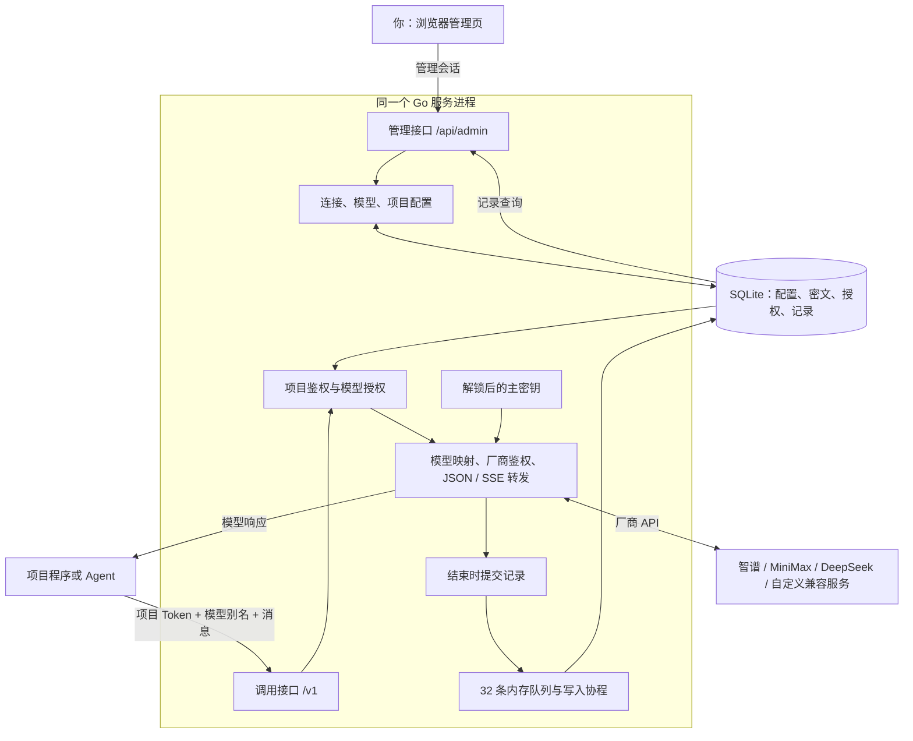

# 当前架构与实现逻辑

核对日期：2026-09-16。以当前源码为依据；本文解释已实现的系统，[README](../README.md)保留范围和选型依据，[Demo 使用说明](demo.md)负责启动和操作步骤。

## 1. 当前项目解决什么问题

当前产品是供个人工具和 Agent 使用的 LLM 网关。它承担四项职责：集中保管厂商 Key、提供调用入口、按项目限定模型权限、记录模型通信。

配置流程：**你创建厂商连接 → 创建模型映射 → 给项目授权模型 → 把网关端点、项目 Token 和模型别名填入程序。**

调用流程：**程序请求网关 → 网关核对权限 → 使用厂商 Key 请求模型 → 返回结果 → 保存本次记录。**

这两个流程共享配置，但使用不同身份与接口。第一次配置完成后，普通调用不经过管理页面，也不需要每次在浏览器里操作。

### 已确定的范围

| 决定 | 当前实现 |
| --- | --- |
| 先在本机使用，为单台 Linux 迁移做准备 | 单个 Go 服务、可配置地址与数据目录、浏览器管理页、可交叉构建 |
| 第一版只做大语言模型 | 普通 JSON 和 SSE 调用；智谱、MiniMax、自定义兼容连接及本地模拟连接 |
| 连接与模型在页面配置 | Token、基础端点、协议、模型 ID、别名、名称和部分默认参数可编辑 |
| 项目权限独立 | 每个项目一个有效 Token，按模型内部 ID 授权 |
| 可以复制接入信息 | 复制端点、完整项目 Token，或含模型别名的完整配置 |
| 当前允许本地临时空白解锁 | 启动开关控制，旧库首次用原密码激活；以后启动自动解锁，管理登录独立 |

账号密码的通用保管、`vault://` 引用解析与真实密钥分发、百炼 ASR、豆包 ASR 和视频生成仍属于后续方向，未接入当前业务流程。

## 2. 部署结构：一个服务进程，一套数据



浏览器管理界面由 React 编写，Vite 生成静态文件，再通过 Go 的 `embed` 打进可执行文件。运行时通常只有：

- 一个 `gateway` 进程，同时提供页面、管理接口和调用接口；
- 一个数据目录，其中的 SQLite 数据库保存配置和记录；
- 你的项目程序，经 HTTP 调用网关。

Node.js 用于开发和构建前端，打包后运行网关不需要单独的 Node 服务。SQLite 不需要另外启动数据库进程；当前也没有 Redis、外部消息队列或容器编排。

**网关只处理主动发送到它的请求。** Agent 必须把对应请求的端点配置为网关地址；直连厂商或走其他内置端点的请求不会出现在这里。

## 3. 四个业务对象如何关联

### 3.1 厂商连接：决定去哪里、用什么 Key

一条连接保存名称、厂商标识、按协议配置的 API 基础端点、共用的加密 Token 和启用状态。`endpoints` 中至少配置 `chat` 或 `messages` 之一，也可以同时配置两个；未配置的协议不可调用。

同一厂商可以建多条连接，例如分别使用开发和生产 Key；一个连接可以被多个模型共用。这里的“删除厂商”在数据层删除的是选中的连接，其他同厂商连接独立保留。

当前厂商标识为 `zhipu`、`minimax`、`deepseek`、`custom`、`demo`。智谱、MiniMax、DeepSeek 与自定义连接均支持独立启用 Chat／Messages；模板按协议预填地址，自定义连接手填兼容服务的地址。两个入口共用一份 Token；若凭据或上游模型 ID 不同，应分别配置连接／模型。演示连接固定为本地 Chat 模拟协议。表单内临时关闭再打开协议会保留手填地址；选择其他厂商模板会预填对应地址。远程端点要求 HTTPS，本机可用回环 HTTP。

### 3.2 模型：对外名字与厂商模型之间的映射

| 字段 | 含义 | 修改影响 |
| --- | --- | --- |
| `id` | 网关内部 ID | 授权引用这个值，常规编辑不会更换 |
| `name` | 管理页面的显示名称 | 不影响程序调用 |
| `alias` | 程序请求的 `model` 值，例如 `coding` | 全局唯一；修改后客户端需更新 |
| `connection_id` | 使用哪条连接 | 决定厂商 Key 及各协议的基础端点 |
| `protocols` | 模型启用的一种或两种协议 | 仅能选择连接已配置的协议；按请求路径选择，不做 Chat／Messages 互转 |
| `upstream_model` | 发给厂商的真实模型 ID | 由账号开通情况决定，可由管理员更新 |
| `defaults` | 客户端没提供时补充的参数 | 通用 `temperature`、`max_tokens`；MiniMax Chat 的 `reasoning_split` 与 MiniMax Messages 的 `thinking` |
| `enabled` | 是否允许使用 | 影响后续请求和项目可见模型列表 |

同一个别名 `coding` 可同时用于 `/v1/chat/completions` 与 `/v1/messages`，项目只需授权该模型一次。新建模型默认勾选连接当前已配置的协议，可以取消不支持的协议；已有模型不因连接新增端点而自动扩大协议范围，需编辑模型启用。移除连接端点后，该协议立即不可用，模型的协议选择保留，重新配置端点后恢复；没有任何可用协议的模型不出现在调用方的模型列表中。保持别名不变并沿用兼容协议时，可以更换连接或上游模型 ID。

默认参数保存于现有 `defaults_json`，无需迁移。管理接口校验 `reasoning_split` 为布尔值，`thinking` 为仅含 `type: adaptive | disabled` 的对象。转发依据连接厂商和实际请求协议选择默认值：MiniMax Chat 只补拆分，MiniMax Messages 只补思考模式；其他厂商不补这两项。客户端字段存在即优先，包括 `false`、`null` 和完整 `thinking` 对象，不按真假判断或递归合并。界面仅在 MiniMax 对应协议下显示设置；暂时切换协议／厂商时保留配置，生效仍受转发条件约束。管理员模型测试和项目调用共用补参逻辑，记录输入保持补参前的原始请求。

新增／编辑模型提供按需获取候选项的管理接口 `POST /api/admin/connections/{id}/models`，请求体为 `{protocol: "chat" | "messages"}`。仅接受同源管理员会话和管理请求标记，从该连接已保存的端点与加密凭据发起 `GET <endpoint>/models`，不接受临时 URL 或 Key；停用连接和锁定密钥库拒绝访问。兼容 Chat 的 `created` 秒级时间及 Messages 的 `created_at` RFC 3339 时间，模型按 ID 去重，时间未知排后，同时间按 ID 排序；不从名称推测发布时间。Messages 分页使用 `limit`／`after_id`，最多 5 页／5000 条、每页 4 MB、总超时 15 秒；遇到上限或不明确分页返回 `truncated: true`，界面明确提示仅为部分结果。禁止跟随重定向，不透出上游错误正文或传输错误中的敏感内容，不进入推理记录与监控。

目录结果仅保存在表单当前内存中，切换连接／协议或关闭窗口时取消并丢弃原请求；无数据库迁移。默认展示前 10 个，支持 20／50／全部及先搜索后截取；选择后同步填入上游 ID、厂商显示名称和以模型 ID 为值的调用别名，再次选择会更新这三项，用户仍可手动修改；协议和授权保持不变。无列表接口和未知时间均有明确提示并保留手填。目录不等于模型具备所选协议能力或当前套餐权限，模型测试承担真实可调用性验证。

默认参数只是缺省值，客户端显式传值时优先采用客户端值；它们不构成不可突破的项目额度限制。

### 3.3 项目：代表一个调用方

项目可以是代码助手、写作工具或自己的应用。它是网关里的身份记录，不自动绑定本机文件夹或某个开发平台。

一个项目有一个当前有效 Token，并获得若干模型的权限。模型与项目是多对多关系，存放在 `project_models` 中。

示例：项目 A 被授权 `coding`、`fast`，项目 B 只被授权 `fast`。B 即使知道 `coding` 这个名字，也不能调用。两个项目可以共享同一厂商连接，权限仍通过项目—模型关系分别判断。

两个程序若使用同一个项目 Token，会被视为同一身份。需要分开授权和追踪时，应分别建立项目。

### 3.4 请求记录：一次调用的快照

记录包含请求 ID、项目 ID 与名称、模型 ID、调用别名、厂商模型 ID、协议、时间、状态、输入输出和厂商报告的 Token 用量。

历史记录保存当时的名称和内容，不依靠当前配置还原。因此模型或项目被删除后，旧记录仍可以查看。

当前没有独立会话表、Agent 任务表或上下文存储流程。多轮对话由客户端维护并随每次请求传入；网关不自动从历史记录补充上下文。

## 4. 一次调用怎样执行

客户端通常配置三项：

```text
BASE_URL=http://127.0.0.1:8317/v1
API_KEY=项目的完整 Token
MODEL=coding
```

以 `POST /v1/chat/completions` 为例：

1. **识别项目。** 读取 Bearer Token 或 `x-api-key`，计算摘要并查询项目，检查项目启用状态。客户端传入的项目名字不决定身份。
2. **解析请求。** 读取 JSON，请求体上限为 2 MiB，从 `model` 提取调用别名。
3. **检查授权并选择连接。** 用别名找到模型，同时检查模型启用、连接启用，以及当前项目是否被授权该模型。
4. **选择协议端点。** `/v1/chat/completions` 对应 `chat`，`/v1/messages` 对应 `messages`；检查模型是否启用该协议、连接是否配置该端点，缺少任一条件即拒绝，不回退到其他协议。
5. **取得厂商凭据。** 用内存中的主密钥解密这条连接的 Token。服务锁定时，真实转发在此停止。
6. **整理上游请求。** 删除客户端提交的顶层 `project_id`、`connection_id`、`base_url`、`api_key`、`token`；补充模型默认参数，按已解析的厂商、实际模型和协议应用兼容规则，把 `model` 改成厂商模型 ID。
7. **发送请求。** 基础端点来自已配置连接的对应协议；网关添加调用路径和厂商鉴权头，不把项目 Token 当作厂商 Key 发送。
8. **返回响应。** 普通 JSON 收齐后返回；SSE 按完整事件逐个转发并刷新输出。
9. **保存记录。** 结束时把记录放入内存队列，后台写入 SQLite。

保留下来的业务 JSON 字段以 `json.RawMessage` 表示，工具定义、工具调用、工具结果、思考内容等无需先缩减为文本。网关负责转发内容，工具实际执行和下一轮对话仍由 Agent 负责。

### 当前协议能力

| 客户端入口 | 用途 | 上游处理 |
| --- | --- | --- |
| `GET /api/public/models` | 无需认证，列出全网关已启用且有可用协议的模型别名、显示名称与协议 | 本地查询，不请求厂商；不返回连接信息、上游模型 ID 或凭据 |
| `GET /v1/models` | 列出当前项目获授权、模型与连接均启用的别名 | 本地查询，不请求厂商模型列表 |
| `POST /v1/chat/completions` | Chat Completions 普通／流式调用 | 连接的 `chat` 基础端点追加 `/chat/completions` |
| `POST /v1/messages` | Messages 普通／流式调用 | 连接的 `messages` 基础端点追加 `/messages` |

Messages 转发配置 `x-api-key`、Bearer 鉴权及 `anthropic-version`，并允许传递客户端的 `anthropic-beta`。没有提供自动 Chat↔Messages 转换、Responses、Realtime、Token Counting 或任意代理路径。

Anthropic SDK 的 Base URL 应填写网关根地址，由 SDK 添加 `/v1/messages`；管理页“接入信息”会按所选客户端协议给出不同地址。

公开目录固定返回全网关的目录，携带项目凭证也不会按项目筛选；响应格式为 `{"object":"list","data":[{"id":"调用别名","object":"model","name":"显示名称","protocols":["chat","messages"]}]}`，按别名排序，空目录返回 `data: []`。协议取模型启用协议与连接已配置端点的交集，模型或连接停用、交集为空时不展示；无需项目授权、主密钥解锁或上游探测。这个目录表示配置的能力，不承诺上游实时可用，也不授予调用权限。无需认证不等于开放网络监听，其他设备仍需能够访问网关地址。

**外部保持统一端点与自定义模型别名，内部由网关承担厂商兼容。** `proxy.go` 负责鉴权、路由和同协议传输；`provider_adapters.go` 按已解析的连接厂商、上游模型 ID 和请求协议分派参数适配，管理员测试与项目调用共用。规则不按项目、客户端名称或公开别名匹配。同一项目可授权 MiniMax、智谱等多个模型，并共用一个项目 Token；后续厂商差异在各自分支增补，不复用其他厂商的规则。

当前规则仅匹配 `minimax`＋`MiniMax-M3`（忽略大小写）＋`messages`：将 `thinking.type=enabled` 转为 `adaptive`，移除该对象中的 `budget_tokens`。这是开启思考的语义转换，固定思考预算不再有效；独立的 `max_tokens` 总输出上限及其他字段保持原值。规则在默认参数补充后执行；`adaptive`、`disabled`、缺失、`null`、未知形式保持不变，其他模型／协议／厂商不应用此转换。依据 [MiniMax M3 Thinking 控制](https://platform.minimax.cn/docs/api-reference/text-anthropic-api)。

转换以 `adaptations` 数组存入现有请求 JSON（规则 ID、字段、转换前后枚举值、移除字段名），不额外复制业务正文或凭据；列表摘要与详情均可读取，无需数据库迁移。`input` 仍保留默认参数和适配前的请求；页面在请求详情各页签上方直接展示转换。旧记录没有此字段，不追溯推断是否适配。厂商未指定的新规则仍按原协议透传，不代表所有厂商差异均已适配。

### 两种测试入口的区别

- 模型页“测试连接”是管理员测试，会绕过项目授权关系，但仍检查模型、连接启用状态，并使用同一转发逻辑，记录身份为“管理员测试”。
- 请求页“以项目身份试调用”使用真实的项目 Token，完整经过项目鉴权和授权检查。

因此，管理员测试成功，只能说明所测模型的转发可用，不能替代项目权限验证。

## 5. 权限与密钥为什么这样设计

### 5.1 三类凭证各有用途

| 凭证 | 用途 | 由谁持有 |
| --- | --- | --- |
| 管理密码 | 标准模式登录并解锁主密钥 | 你 |
| 项目 Token | 识别项目、限定可调用模型 | 对应项目程序 |
| 厂商 Token | 向智谱、MiniMax 等进行鉴权 | 网关；管理员可主动查看 |

项目的普通调用接口不能读取厂商 Token 或进入管理接口。允许某项目使用模型，并不等于允许它查看连接里的 Key。

### 5.2 管理接口与调用接口分开认证

管理接口检查配置的 Host、Origin／跨站标记及管理员会话。会话采用随机值，服务端内存保存其摘要和过期时间，浏览器 Cookie 为 HttpOnly、SameSite Strict；会话期限 12 小时。管理非 GET 请求还要带 `X-Gateway-Admin: 1`。

项目调用只认项目凭证，不因请求来自 `localhost` 或页面已登录就赋予管理权限。当前没有组织、角色或多个管理员账户系统；管理会话之间共享同一工作空间。

“服务已解锁”是进程级状态；“管理员已登录”是具体会话的状态。本机免密模式完成首次激活后，在 HTTP 服务开始监听前自动解锁，不创建管理会话，项目可直接调用。页面“退出管理”调用 `POST /api/admin/logout`，只撤销当前会话；关闭页面、退出或会话过期均不影响模型调用。标准密码模式重启后仍需人工解锁。兼容保留的 `POST /api/admin/lock` 会显式清除主密钥和全部管理会话，但页面退出不再调用它。模型列表只查询权限，不需要解密厂商 Key，所以锁定期间并非所有接口都会停止响应。

### 5.3 加密保存与项目 Token 复制

标准模式先随机生成 32 字节主密钥。管理密码通过 Argon2id 与随机盐派生密钥，再包裹主密钥；厂商和项目 Token 由主密钥通过 AES-256-GCM 加密。

```text
管理密码 + 随机盐
        ↓ Argon2id
密码派生密钥 → 解开主密钥
                       ↓ AES-256-GCM
               厂商 Token / 项目 Token
```

厂商凭据使用连接 ID 作为认证数据；项目凭据使用 `project:` 加项目 ID，防止密文被当作其他对象的凭据使用。数据库并未整体加密，配置名称和调用正文等仍是可读数据。

项目 Token 同时保留两种表示：

- SHA-256 摘要用于鉴权，不必为每次项目身份校验解密原文；
- 加密副本用于你主动复制 Token 或填入试调用。

新建、重置时，摘要和密文在同一个数据库事务里提交。保存失败时回滚，避免客户端拿到的新 Token 与服务器记录不一致。旧版只有摘要的项目，需要保存原有效 Token，或明确重置；摘要不能反推出原文。

普通管理列表只返回凭证前缀和保存状态；复制操作通过专用管理员接口按需取出完整值。浏览器页面暂存不写入 localStorage 或 sessionStorage，刷新／退出管理时清除；复制到系统剪贴板的内容由剪贴板自身保存。

### 5.4 当前临时免密模式的实际含义

`start.sh` 当前默认传 `--local-no-password`，只允许回环监听和回环管理地址。第一次用原密码解锁后，额外保存一份由空密码派生密钥包裹的主密钥；原密码包裹继续保留。以后启动自动读取该材料恢复内存主密钥，空白提交仅在访问管理页时建立管理会话，也可用于查看厂商 Token。自动解锁材料损坏会阻止启动并提示恢复路径；未激活的旧库仍需首次输入原密码，不能凭空解密。

这个模式保留调用授权和接口认证流程，但**管理入口不再依赖秘密密码**。能访问该管理入口并发出符合来源校验请求的本机程序，可能进入管理端。它不能用来保证同一操作系统账号下的 Agent 永远拿不到凭据。

关闭开关后恢复原密码登录，并删除活动数据库内的临时解锁材料；旧备份里的材料不自动清理。迁移 Linux 应使用标准模式。

更一般地，当前隔离发生在网关接口内，不提供进程、文件系统或浏览器权限隔离。拥有管理浏览器或数据目录的主体属于更高的信任范围。

## 6. 速度与调用记录怎样兼顾

### 6.1 转发速度

Go 服务共享一个 HTTP 客户端和连接池；池中最多保留 32 条空闲连接、每个上游主机最多 8 条空闲连接。这是空闲连接复用参数，不是项目并发额度。

SSE 收到一个完整事件后立即转发并 Flush，设置 `X-Accel-Buffering: no` 提示反向代理不缓冲。客户端取消通过请求上下文传到上游；不自动跟随厂商重定向，防止携带鉴权去往其他地址。

普通响应会完整读取后返回，并非所有模式都逐字节透传。当前没有模型回复缓存、应用层自动重试、跨厂商回退或自动选择更快线路。

### 6.2 记录保存

每次转发在内存中收集记录，结束后尝试写入容量 32 的队列；一个后台协程串行落库。记录写盘不必在请求处理函数里同步等待，但鉴权、配置查询和记录写入共用同一个 SQLite 连接，仍可能相互等待。

队列满或数据库写入失败时计入 `dropped_records`；该计数保存在进程内存，重启后不保留。当前不保证每次失败或进程崩溃前的请求都有记录。

以下情况需要区别看待：

| 情况 | 记录行为 |
| --- | --- |
| 未通过项目鉴权、请求解析、模型授权或协议检查 | 保存监控摘要，并尝试异步保存请求记录；不保存未验证的原始请求体 |
| 主密钥锁定、厂商凭据解密失败 | 记录网关错误 |
| 已进入转发后的上游请求及多数失败 | 结束时提交记录，仍受队列和写盘结果约束 |
| 流式请求进行中 | 监控显示进行中与当前并发；完整正文日志在结束后保存 |
| 删除项目、模型或连接 | 历史记录保留 |

记录的输入是移除客户端路由／鉴权字段并脱敏后的项目请求，保存时尚未补默认值和替换上游模型 ID；**当前没有另存一份真正发往厂商的最终请求体。** 输出也会脱敏，SSE 按事件整理过，所以“原始数据”不是字节级网络抓包。

脱敏针对本次已知厂商 Token、项目 Token 的字符串替换，不是覆盖所有个人信息或任意编码形式的通用脱敏系统。业务输入输出本身仍可能包含用户敏感内容。

### 6.3 指标和限制

`GET /api/admin/metrics` 使用管理员认证，支持最近 1 小时、24 小时、7 天或全部（`window=all`），可按项目、厂商连接、模型和流式模式筛选。全部以持久保存的 `monitoring_since` 为起点，累计至当前时间，重启不重置；六组指标、模型表现与 24 个趋势时间桶均覆盖该范围，近期调用仍显示最近 8 条。统计范围为模型调用入口和管理员模型测试，不包括管理接口、模型列表或未支持的路径。六组指标为请求结果、首次响应、Token 用量、总耗时、请求量与并发、输出速度。

- TTFT（Time to First Token）从转发准备开始计时，到首个非空思考、正文或工具内容；TTFC（Time to First Content，项目约定）到首个正文内容，沿用 `first_text_ms` 存储字段。忽略空事件、心跳和纯用量事件。
- 总耗时从网关收到调用到结束，包含鉴权与转发，不包含结束后的统计和正文落库时间。`forward_offset_ms` 连接两种计时起点。新非流式请求不记录虚假的首字时间。
- 流式 HTTP 200 不等于成功；错误事件、未收到协议结束标记、读写失败均不能记为完成。超时、429、上游错误、网关拒绝、客户端取消／断开分别归类。成功率分母为成功＋失败，排除进行中和客户端取消；拒绝包含在失败中。
- Chat 流保留 `[DONE]` 结束标记，并兼容 MiniMax 等服务省略该标记、仅返回 `finish_reason: "stop"` 或 `"tool_calls"` 的情况：正常读到流末尾，且所有已出现的候选回答均收到这两种结束原因之一、数量不少于请求的 `n`（默认 1）时，也判为完成。`tool_calls` 表示本轮模型输出结束、等待客户端执行工具，不代表整个多轮任务已经完成。收到结束原因后继续转发当前包正文／工具参数与后续用量；读写错误、超时或流内错误仍优先判为异常。该规则按 Chat 协议通用处理，不依赖厂商或模型名称；Messages 的 `message_stop` 沿用原规则。不将任意非空结束原因视为成功，也不改写历史结果或思考计时。
- 用量只采用厂商报告，零和缺失分开。Chat 的 `prompt_tokens` 是输入总量，`cached_tokens` 是其中的缓存读取；通常 Messages 总输入为 `input_tokens + cache_read_input_tokens + cache_creation_input_tokens`，任一组成缺失时总量未知。MiniMax M3 的 Messages 自动缓存按官方口径使用普通输入＋缓存读取：缓存写入缺失或为 0 都不阻塞总量，缺失仍保留为空并显示“未单列（自动缓存）”，不伪造写入零；若明确报告正数写入，仍按三项相加。此规则以实际厂商 `minimax`、上游模型 `MiniMax-M3` 和协议为边界，不依赖调用别名，不扩展到其他模型或自定义厂商。重复累计用量覆盖前值，不叠加。正常结束且输入总量、最终输出均报告才算用量完整。
- 已有监控记录在列表、详情和总览读取时使用相同的 M3 输入归一化，不修改数据库和原始响应；旧摘要未保存最终输出确认标记，补足输入后也不追认最终用量或补算历史速度，详情明确显示“最终用量未确认”。后续新请求继续按正常结束及最终输出上报确认完整性。MiniMax 口径依据：[Prompt Caching](https://platform.minimax.io/docs/api-reference/text-prompt-caching)。
- 缓存命中占比为有缓存统计的请求的缓存读取之和／这些请求的输入总量之和，排除未知，不能平均每条百分比。缓存写入单列，不能当命中或与输入总量重复相加。
- 估算输出速度为 `(输出 Token − 1) / (最后有效内容 − 首个有效内容)`，TPOT 是其倒数换算成毫秒。仅流式成功、用量完整、至少两段有效内容、输出 Token 大于 1 且时间跨度大于 0 时提供；不把分片当成 Token，不把末尾用量延迟算作输出阶段。
- P50／P95 使用 nearest-rank 分位数，并返回有效样本数。时延统计只采样成功请求；首次响应和速度只采样流式。总耗时可通过流式筛选分别比较。
- 请求从入口计数，`request_metrics` 独立保存不含正文和凭据的摘要，入口写入进行中，结束时更新。进程重启后遗留进行中标为异常中断。内存并发使用相同筛选，包含在统计窗口之前开始且仍进行中的请求。RPM 为请求数／实际已监控分钟数，趋势为 24 个时间桶。
- 新监控从数据库升级时开始，持久保存起始时间；不把旧日志补成完整历史统计。原始历史记录保留，带 `metrics_version=1` 的新记录与旧口径区分。统计读取窗口内所有摘要，不受正文列表最近 200 条限制。

正文仍异步写入，最多各 1 MiB，丢弃计数保留。统计入口／结束同步写入 SQLite，因此不受正文队列丢弃影响，但会增加少量数据库操作；统计写入失败会明确告警，不能保证磁盘故障或进程崩溃时绝不丢失。累计写入错误告警为进程内计数，重启归零。缺正文时详情可回退到监控摘要并明确提示。

请求体最大 2 MiB，普通响应最大 8 MiB，SSE 单行／事件保护上限约 1 MiB；响应头等待 45 秒，上游调用最多 10 分钟。旧记录列表保持最近 200 条；尚无自动清理策略。测试使用模拟上游，真实网络延迟、生产吞吐与同步统计写入开销尚需服务器实测。

### 6.4 价格与费用

模型保存可选 `pricing` 配置，路由时固定价格，调用结束时根据同一份归一化用量计算 `cost`，同时保存在请求记录与持久监控摘要中。总览按币种汇总完整与部分估算，沿用已有筛选并增加项目费用分组；价格未知、套餐、旧记录和用量不完整单列。SQLite v6 增加 `models.pricing_json`，不追算旧记录。完整规则、接口字段和限制见 [价格与费用](costs.md)。

## 7. 数据保存与删除逻辑

SQLite v5 在事务中把旧连接的单协议地址迁移到 `endpoints_json`，旧模型迁移为仅启用原协议；连接／模型 ID、加密 Token、项目授权及历史记录不变。旧管理 API 的单协议创建仍可使用，读取返回新结构；旧格式编辑多协议连接会拒绝，避免误删另一端点。

当前 SQLite schema 版本为 5，共八张业务／支撑表：

| 表 | 保存内容 |
| --- | --- |
| `meta` | 密码盐、包裹后的主密钥、可选的本地免密解锁材料 |
| `connections` | 厂商连接、协议端点映射 `endpoints_json`、Token 密文和状态 |
| `models` | 别名、显示名称、厂商模型 ID、连接、默认参数和状态 |
| `projects` | 项目名称、状态、Token 摘要与前缀 |
| `project_credentials` | 可供管理员取回的项目 Token 密文；旧项目可以暂缺 |
| `project_models` | 项目与模型授权关系 |
| `requests` | 查询索引字段、无正文摘要、带输入输出的完整记录 JSON |
| `request_metrics` | 独立的请求监控摘要，包含前置拒绝与进行中，保留模型和连接快照 |

数据库启用外键、WAL 和 5 秒 busy timeout，Go 侧最大数据库连接数设为 1。HTTP 请求可以并发执行，数据库操作被串行安排；当前服务不属于整个请求从头到尾都串行的模型。

版本升级由 `Open` 处理：旧 v1 请求补充摘要列，v2 增加项目凭证加密副本表，v4 增加独立监控表；更高版本数据库会被拒绝打开。没有独立的迁移框架，也没有 PostgreSQL 实现。

删除时以当前关联关系和事务保证一致性：

- 删除模型：原子移除项目授权和模型，旧别名之后可重用，但新模型不会继承授权。
- 删除项目：删除项目、授权及 Token 加密副本；其他配置与历史记录保留。
- 删除连接：窗口列出全部关联模型，可逐个删除，也可一键级联。级联提交已查看的模型 ID 清单，服务端在事务里核对最新清单；有变化就要求刷新，避免额外删掉未展示的新模型。

停用、重置或删除影响后续请求；正在执行的请求已经取得所需配置和凭据副本，不保证立即停止。

## 8. 前端结构与模块职责

前端目前是 React 单页应用，用 `useState`／`useRef` 管理页面、表单、请求详情和凭证暂存；页面切换由应用状态控制，没有额外路由或全局状态库。

管理页面分为概览、厂商连接、模型配置、项目权限、请求记录。登录后读取配置状态与记录摘要；页面可见时约每 5 秒刷新。详情在选中记录时单独读取正文，试调用通过 Fetch 流读取 SSE 文本。

| 文件 | 主要职责 |
| --- | --- |
| [`cmd/gateway/main.go`](../cmd/gateway/main.go) | 解析启动参数、限制监听模式、启动 HTTP 服务、处理退出信号 |
| [`internal/gateway/http.go`](../internal/gateway/http.go) | 接口注册、登录会话、来源校验、管理认证、静态资源入口 |
| [`internal/gateway/admin.go`](../internal/gateway/admin.go) | 配置增改、Token 查看、记录查询、创建本地演示 |
| [`internal/gateway/proxy.go`](../internal/gateway/proxy.go) | 项目鉴权、模型授权、上游请求构造、JSON／SSE、统计及模拟响应 |
| [`internal/gateway/store.go`](../internal/gateway/store.go) | 数据结构、SQLite 初始化升级、加解密基础函数、主密钥和日志写入 |
| [`internal/gateway/project_credentials.go`](../internal/gateway/project_credentials.go) | 项目 Token 保存、取回、旧 Token 补存、原子重置 |
| [`internal/gateway/local_unlock.go`](../internal/gateway/local_unlock.go) | 临时空白解锁的启用、材料保存及关闭 |
| [`internal/gateway/delete.go`](../internal/gateway/delete.go) | 配置删除及关联事务 |
| [`web/src/main.tsx`](../web/src/main.tsx) | 应用状态、五个页面、表单、登录及请求查看／试调用 |
| [`web/src/ProjectList.tsx`](../web/src/ProjectList.tsx) | 项目权限列表、模型授权与状态展示、接入及管理操作入口 |
| [`web/src/ProjectAccessContent.tsx`](../web/src/ProjectAccessContent.tsx) | 端点与 Token 复制、协议选择、模型别名、补存与重置 |
| [`web/src/ModelList.tsx`](../web/src/ModelList.tsx) | 模型列表与窄屏操作布局 |
| [`web/src/ConnectionDeleteContent.tsx`](../web/src/ConnectionDeleteContent.tsx) | 关联模型列表、单个删除及级联删除确认 |
| [`web/src/protocol.mjs`](../web/src/protocol.mjs) | 为管理界面提取消息、可见文本和 SSE 数据 |
| [`web/src/credentials.mjs`](../web/src/credentials.mjs) | 项目凭证格式校验和页面内存暂存 |
| [`web/embed.go`](../web/embed.go) | 把前端构建结果嵌入 Go 程序 |

上述“模块”主要是文件和函数职责划分。后端业务共享 `Gateway` 对象和 SQLite，使用直接 SQL；没有独立服务层、仓储层或跨语言类型生成。`HTTPDoer` 是可替换的上游调用接口，用于测试替换 HTTP 客户端。

当前结构的收益是调用链容易跟踪、部署组成少；代价是 `main.tsx`、`proxy.go`、`store.go` 职责较集中。后续功能增长时，可以围绕已出现的重复和变更点拆分，不需要先改成微服务。

## 9. 迁到 Linux 时什么会改变

核心流程、SQLite 数据和协议入口可保留；改变的是可执行文件目标平台、服务地址、启动管理和网络入口。

1. 为目标架构构建 Linux 可执行文件，前端一起嵌入；目前已交叉构建 amd64、arm64。
2. 在本机关闭临时免密模式，正常停止服务，制作一致的数据副本。
3. 将对应二进制和完整数据副本放到 Linux，设置数据目录权限，沿用原管理密码解锁。
4. 小范围自用可继续回环监听并通过隧道访问；外部入口使用 HTTPS 反向代理与 `--public-url`，保留流式转发。
5. 项目修改网关地址；若保留数据，项目 Token、模型别名与授权可继续沿用。

直接运行二进制默认不启用临时免密。核心不依赖 macOS 钥匙串，SQLite 驱动不依赖 CGO。当前未提供完成部署验证的 systemd 单元、容器方案或真实 Linux 运行结果。

迁移后请求路径变成“客户端 → Linux → 厂商”。是否更快取决于这两段网络与服务器位置；现有代码只能减少不必要的缓冲和重复连接，不能消除远程往返。需要用目标服务器实测首字时间和总耗时。

## 10. 实现成熟度与后续顺序

| 层面 | 当前状态 |
| --- | --- |
| 基本业务闭环 | 配置、授权、调用、记录、编辑删除、接入信息复制已实现 |
| 自动化验证 | 前轮通过 19 个 Go 集成测试（含竞态检测）、7 个前端单元测试、4 个常规浏览器测试和 1 个空白解锁浏览器测试 |
| 布局验证 | 已检查相关页面／窗口的桌面、窄屏、深色及文字放大；空白解锁登录页检查桌面和手机宽度 |
| 构建 | macOS 与 Linux amd64／arm64 已构建 |
| 真实厂商联调 | 尚未形成已验证记录；已有代码和配置不等于每种套餐、模型、Agent 都兼容 |
| 性能 | 有流式与取消行为测试，没有正式吞吐、内存、网关开销或真实网络基准 |
| 运维 | 数据一致备份步骤已有；日志保留策略、费用预算、项目限流和多实例尚未实现 |

从当前进度判断，优先保留单进程、配置与调用分开的结构。后续建议依次解决真实使用中的三个问题：

1. **用实际 Agent 跑通智谱和 MiniMax。** 验证套餐端点、协议、工具循环和流式返回；这是兼容性的直接证据。
2. **完善排查所需的记录。** 如果要精确分析网关改了什么，增加脱敏后的最终上游请求体；如果要查所有拒绝请求，再补前置失败记录及保留期限。
3. **在准备迁移时验证 Linux。** 处理标准密码模式、服务启动方式、一致备份和真实网络性能。

更多厂商、协议及语音视频能力在有实际需求时沿现有对象和调用链扩展；适配器抽象、数据库并发优化和组件拆分应服务于这些明确问题。以上为建议顺序，尚未作为本轮实施任务。

## 11. 本次梳理的依据

本次逐项核对启动入口、路由与认证、代理转发、数据库定义、项目凭证、临时免密、删除事务、前端状态与现有测试源码，并参考前轮验证结果。没有读取真实厂商 Key 或调用厂商接口；没有修改业务逻辑或把既有性能测试结论扩大为生产保证。
