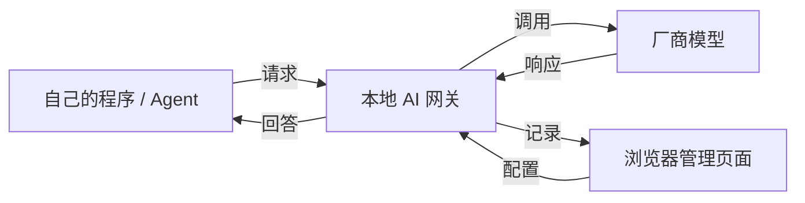
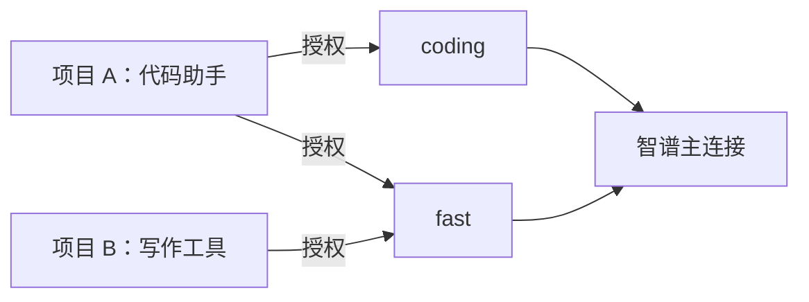
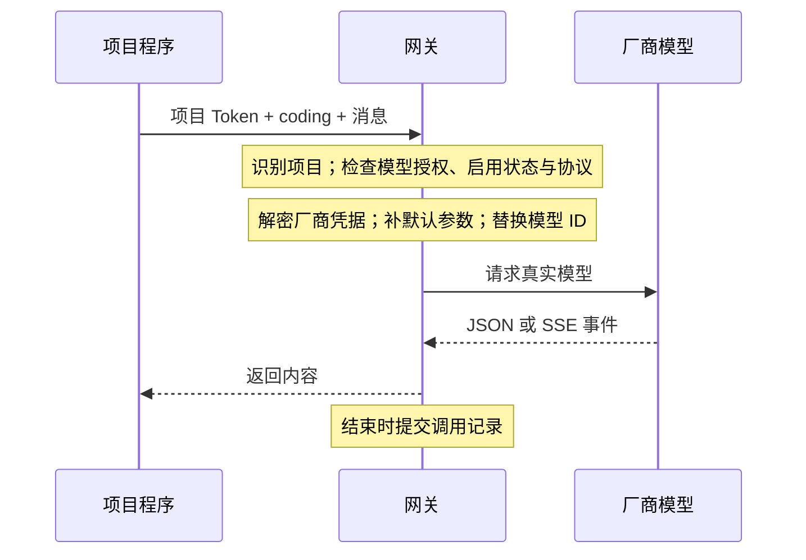
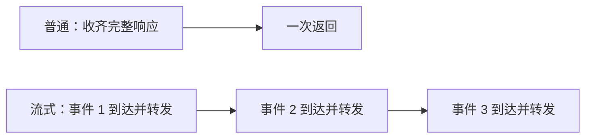
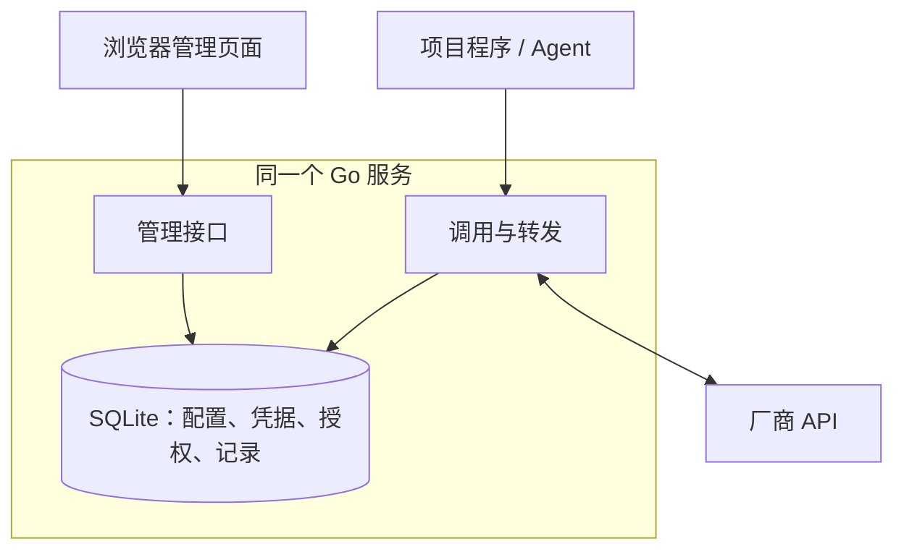
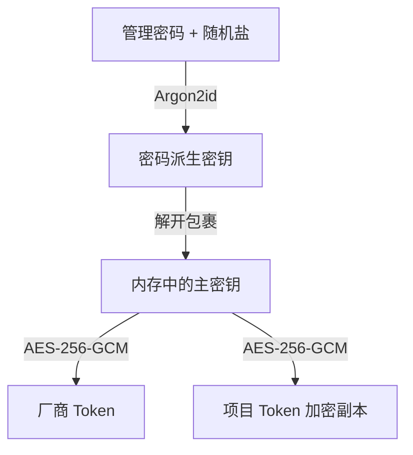
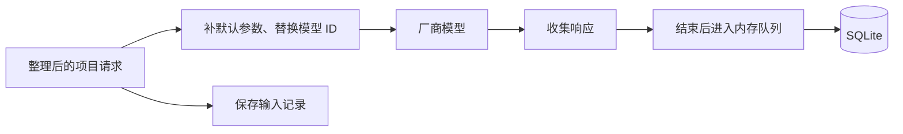

# 本地 AI 网关｜项目理解报告

> 2026-09-15 · 基于当前源码与项目文档 · 面向项目所有者

本报告使用 explain-project 的逐层讲解方法，从用途、对象和正常流程进入实现与边界。历史测试结果明确标注日期；本轮未运行业务测试或调用真实厂商。

## 1. 一个入口，管理自己的模型调用

**本地 AI 网关供自己的程序和 AI Agent 共用：集中保管厂商凭据，按项目开放模型，并留下可检查的通信记录。**

例如，代码助手和写作工具各有一个项目身份。你在网关配置可用模型，再把网关地址、对应的项目凭证和模型别名填进工具。之后工具提交消息，网关调用厂商并返回回答，你通过管理页面检查过程。

“本地”指网关运行在自己的电脑上。真实推理由已配置的厂商完成；内置演示模型只返回固定说明文字，用来验证接入流程。

*图 1  日常调用与管理入口：程序发消息，你管理配置和查看结果。*

### 这个项目带来的三项直接收益

| 收益 | 具体变化 |
| --- | --- |
| 凭据集中保管 | 厂商 Token 保存于网关；各个程序使用独立的项目 Token。 |
| 模型配置集中调整 | 程序使用固定别名；保持协议兼容时，可以在网关更换实际模型。 |
| 模型通信可检查 | 能查看已记录调用的消息、完整返回字段或流式事件，以及耗时和状态。 |

**当前定位：核心流程已实现、经模拟环境验证的个人 LLM 网关 Demo。** 首版聚焦大语言模型。语音、视频、自动选模型、跨厂商回退和费用预算尚未进入当前流程。

*依据：README.md §2、§9；docs/demo.md §已实现的流程；proxy.go:426。源码路径见第 8 页。*

## 2. 四个对象，组成一套配置关系

**连接决定去哪里，模型决定调用什么，项目决定谁能用，请求记录保存发生了什么。**

| 对象 | 作用与边界 |
| --- | --- |
| 厂商连接 | 保存厂商、接口格式、基础地址、加密凭据和启用状态。同一厂商可以配置多条连接。 |
| 模型配置 | 把程序使用的别名映射到连接和真实模型 ID，并提供默认参数。 |
| 项目 | 代表一个调用方，拥有自己的 Token 和模型授权；不自动绑定目录或仓库。 |
| 请求记录 | 保存一次调用的身份、模型、内容、耗时与状态快照。 |

*图 2  配置关系示例。A 可用 coding 与 fast，B 只能用 fast；两个模型可共用连接。*

### 模型名称为什么分开保存

| 字段 | 例子 / 用途 | 修改后的影响 |
| --- | --- | --- |
| 显示名称 | 我的代码模型 | 只影响管理页面。 |
| 调用别名 | coding | 程序填写的 model；改名需同步修改程序。 |
| 厂商模型 ID | 账号实际开通的模型 ID | 决定厂商运行哪个模型；保留别名时，后续请求使用新模型。 |
| 内部 ID | 数据库中的固定身份 | 项目授权引用它；常规编辑不更换这个身份。 |

一个模型可以授权给多个项目，一个项目也可以拥有多个模型。若两个程序共用同一个项目 Token，网关会将它们视为同一调用身份。

*依据：store.go:23、:166；admin.go:163、:223；proxy.go:41、:73。*

## 3. 从配置到调用：先准备，再使用

**配置完成后，程序直接调用网关，不必每次经过管理页面。** 服务需要处于已解锁状态，才能取出厂商凭据。

准备顺序：创建连接并填入厂商 Token → 创建模型映射 → 创建项目并勾选模型 → 复制接入信息到程序。Chat Completions 客户端填写网关的 /v1 基础地址、完整项目 Token 和模型别名。

*图 3  一次成功请求的执行顺序。图中省略重复的配置读取与网络细节。*

### 网关在中间做了哪些改变

| 处理 | 实际规则 |
| --- | --- |
| 身份与路由 | 凭证确定项目；别名确定模型；授权和启用状态均从服务端查询。 |
| 请求内容 | 移除客户端顶层路由、鉴权字段；保留工具及其他业务字段；替换真实模型 ID。 |
| 默认参数 | 只补客户端未提供的值。目前可配置 temperature 与 max_tokens，属于缺省值，不是强制额度。 |
| 厂商鉴权 | 用已配置连接的厂商 Token 发送请求；不把项目 Token 当作厂商凭据。 |

页面有两种测试：**模型测试**使用管理员身份，不检查项目授权；**项目试调用**使用项目 Token，经过完整权限检查。前者成功，不能替代后者的验证。

*依据：proxy.go:90、:126、:176；http.go:180；web/src/main.tsx:117。*

## 4. 协议、流式输出与工具调用

**接口协议约定请求和响应的格式。** 当前按相同协议转发，客户端入口必须与模型连接的协议一致。

| 客户端入口 | 用途 | 网关的处理 |
| --- | --- | --- |
| GET /v1/models | 列出可用模型 | 本地查询该项目已获授权且启用的模型别名。 |
| POST /v1/ chat/completions | Chat Completions 调用 | 连接地址追加 /chat/completions。 |
| POST /v1/messages | Messages 调用 | 连接地址追加 /messages。 |

智谱连接当前使用 Chat Completions；MiniMax 可选 Chat Completions 或 Messages。尚未实现 Responses、Token Counting 和任意协议互转。Messages 客户端按其 SDK 规则填写网关根地址，由 SDK 补上接口路径。

### 普通返回与流式返回

普通调用先收齐完整响应，再返回客户端。流式调用采用 SSE，也就是连续发送的事件；网关收到一个完整事件就转发并刷新输出。

*图 4  返回方式示意，横向间距不代表实际耗时。客户端取消会传递给上游。*

### Agent 执行工具，网关转发工具内容

例如模型要求读取一个文件：模型返回工具调用 → 网关转给 Agent → Agent 读取文件 → Agent 把结果连同上下文发起下一次请求。工具定义、工具调用、工具结果和相关内容块在已支持协议中保留。

**网关不自动执行工具，也不从历史记录补齐对话。** 多轮上下文由客户端维护。模型换成另一种协议时，仅保留同一个别名不足以保证客户端继续兼容。

*依据：http.go:181；admin.go:17；proxy.go:116、:207、:229、:265；docs/demo.md §真实模型配置。*

## 5. 内部结构：一个进程，一套数据

**Go 服务同时提供管理页面和调用接口；SQLite 保存配置与记录。** 前端构建后嵌入可执行文件，日常运行无需另起 Node 服务。

*图 5  运行组成。图中按主要职责分区，不代表存在多个后端服务。*

### 从代码职责理解各部分

| 职责 | 主要文件 |
| --- | --- |
| 启动与接口入口 | cmd/gateway/main.go；internal/gateway/http.go |
| 连接、模型和项目配置 | internal/gateway/admin.go；delete.go |
| 模型转发与流式处理 | internal/gateway/proxy.go |
| 数据库与凭据管理 | store.go；project_credentials.go；local_unlock.go |
| 管理页面与接入信息 | web/src/main.tsx；ProjectAccessContent.tsx；protocol.mjs |

### 配置删除怎样影响历史

删除模型会同时移除它的项目授权；删除项目会让对应凭证失效。删除连接时，可确认关联模型后一起删除。历史请求保留当时的名称和内容快照，不随配置删除。

关联删除使用数据库事务，相关操作一起成功或一起回滚。停用、撤权、重置和删除作用于后续请求，不保证立即中断已经开始的流式调用。

*依据：main.go:24；web/embed.go；store.go:134、:166；delete.go；web/src/main.tsx:37。*

## 6. 三类凭据与网关的解锁状态

**管理密码用于解锁，项目 Token 用于调用网关，厂商 Token 用于调用厂商。** 三者对应不同入口与权限。

| 凭据 | 使用者 | 能做什么 |
| --- | --- | --- |
| 管理密码 | 你 | 建立管理会话、解锁主密钥；标准模式下再次验证后可查看厂商 Token。 |
| 项目 Token | 项目程序 | 调用获授权模型、列举自己的可用模型；无管理和历史检索权限。 |
| 厂商 Token | 网关服务 | 向所配置厂商进行鉴权；加密保存在连接中。 |

主密钥是网关生成的随机加密密钥。标准模式下，它由管理密码派生出的密钥保护；解锁后进入内存，用来解密厂商凭据和项目 Token 的加密副本。

*图 6  标准模式的解锁关系。项目调用鉴权使用另存的摘要，不必先解密项目 Token。*

### 复制、重置与锁定分别意味着什么

项目 Token 同时保存校验摘要和加密副本。复制原值不会改变调用配置；重置才会生成新值并使旧值失效。旧版只有摘要的项目无法反推原文，需要提交原有效 Token 补存，或明确重置。

**解锁是整个服务的状态，登录是浏览器会话的状态。** 关闭页面不会主动锁定网关；点击锁定会清除主密钥和全部管理会话。服务重启后需要重新解锁，才能继续模型调用。

### 当前临时本地模式

启动脚本启用空白解锁开关。首次使用原密码激活后，可留空解锁，原密码仍保留。此模式只允许回环地址，管理入口不再依赖秘密密码；接口内的项目授权仍保留。数据库中的调用正文可读，凭据加密不等于整库加密。

*依据：store.go:89、:230；http.go:51、:78；project_credentials.go；local_unlock.go；scripts/start.sh。*

## 7. 请求记录能解释什么

**记录用于检查一次模型调用的内容、结果和耗时。** 当前保存的是经过整理与凭据脱敏的内容，不是字节级网络抓包。

输入记录在补默认参数、替换真实模型 ID 之前生成。因此它能反映程序提交的业务内容，但不能直接代表最终发给厂商的完整请求体。输出记录保留返回 JSON 或整理后的 SSE 事件。

*图 7  记录位置决定了可以观察到什么；持久化列表通常在调用结束后才出现这条记录。*

| 内容或指标 | 当前含义 / 限制 |
| --- | --- |
| 记录范围 | 鉴权、解析、授权、协议检查、解锁或解密阶段被拒绝的请求，尚未建立记录。 |
| 首字时间与总耗时 | 从转发准备阶段计时；首字取首个有效文本。非流式模式需等完整响应，不含全部前置处理。 |
| Token 用量 | 来自厂商返回；没有上报时，不能把显示的零值理解为准确的零消耗。 |
| 容量与保留 | 请求体 2 MiB；普通响应 8 MiB；输入、输出记录各 1 MiB。列表最近 200 条，没有自动清理。 |
| 写入可靠性 | 记录结束后尝试进入 32 条内存队列；队列满或写盘失败计入未写入数量，重启不保留该计数。 |

**响应转发完成和记录完整保存是两个结果。** 超过记录大小上限会标记截断；SSE 单行或单事件触及约 1 MiB 保护上限时，还可能结束转发。已知凭据会被替换，但业务正文没有通用隐私脱敏。

*依据：proxy.go:152、:176、:265；store.go:195、:354；admin.go:294；docs/demo.md §记录与性能边界。*

## 8. 当前阶段、阅读入口与后续方向

**当前已完成基本业务流程，下一步最有价值的是取得真实使用证据。** 下面区分代码已实现、历史验证记录和仍待验证的部分。

| 层面 | 当前状态 |
| --- | --- |
| 业务流程 | 配置、授权、调用、记录、接入信息复制和关联删除均已实现。 |
| 历史自动化验证 | 文档记载 2026-09-14：19 个 Go 集成测试含竞态检测、7 个前端单测、4 个常规浏览器测试及 1 个空白解锁测试通过。 |
| 构建与运行环境 | 文档记载 macOS 与 Linux amd64 / arm64 已构建；真实 Linux 主机运行待验证。 |
| 厂商与性能 | 真实厂商、套餐和 Agent 联调待验证；没有真实端到端延迟、吞吐、资源占用或网关开销基准。 |

### 建议依次回答的三个实际问题

**1. 真正的工具能否用起来？** 先选一个实际客户端和一个厂商模型，验证普通请求、流式输出、工具循环、项目权限和记录内容。

**2. 现有记录是否足够排查？** 按实际需要决定是否补充脱敏后的最终上游请求体、前置失败记录和历史保留规则。以上均为建议，尚未实施。

**3. 搬到 Linux 后能否保持体验？** 准备迁移时，再验证标准密码模式、正常停机的一致备份、服务启动方式和实际网络耗时。

### 沿着调用链阅读源码

阅读顺序：http.go 的接口入口 → proxy.go 的鉴权与转发 → store.go 的数据与解锁 → admin.go 和前端交互。

| 资料 | 用途 |
| --- | --- |
| README.md；docs/demo.md | 项目范围、操作步骤、限制与历史验证结果。 |
| docs/current-architecture.md | 按源码核对的详细架构与实现说明。 |
| internal/gateway/；web/src/；web/tests/ | 后端、前端与测试。后端测试位于同目录的 *_test.go。 |

**阅读说明**：路径均相对 local-ai-gateway 项目根目录，图中名称为示例。本轮只生成报告，测试结果引用历史记录；讲解顺序采用 explain-project 技能。
